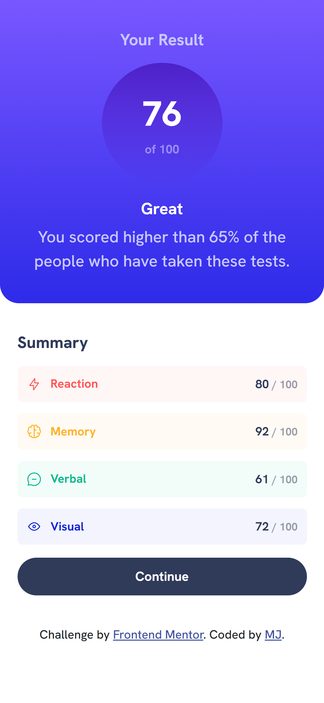
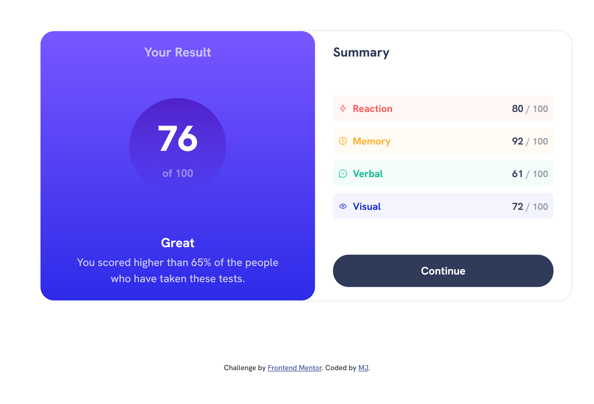

# Frontend Mentor - Results summary component solution

This is a solution to the [Results summary component challenge on Frontend Mentor](https://www.frontendmentor.io/challenges/results-summary-component-CE_K6s0maV). Frontend Mentor challenges help you improve your coding skills by building realistic projects. 

### Overview

### Links

- Solution URL: [Click to view Solution](https://www.frontendmentor.io/solutions/results-summary-component-solution-XztvVTArUP)
- Live Site URL: [Click to view Live Site](https://coded-by-mj.github.io/Front-end-Mentor-Challenge9/)

## My process

### Built with
- Semantic HTML5 markup
- Bootstrap
- SCSS
- Javascript
- Mobile First Workflow

- Frontend Mentor - [@Coded-by-MJ](https://www.frontendmentor.io/profile/Coded-by-MJ)
- Twitter - [@MiracleJustice_](https://twitter.com/MiracleJustice_)